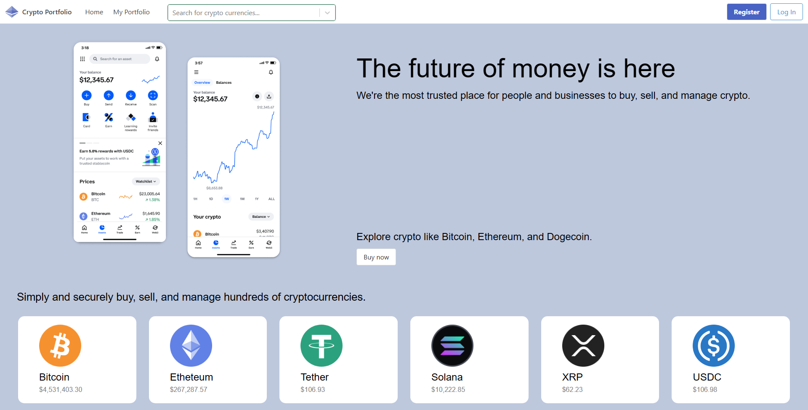

# DRS-Crypto-Portfolio

## Sadrzaj
- [About the Project](#about-the-project)
- [Used Technologies](#used-technologies)
- [Aplication layout](#aplication-layout)

- ## About the Project

The portfolio serves as a comprehensive tool for users to monitor the real-time value of their cryptocurrency holdings. Comprising three integral components:

- ## User Interface
    The User Interface is a dynamic Flask web application designed to facilitate user interactions with financial transactions. Users can seamlessly manage their cryptocurrency portfolios, entering transactions and gaining insights into their investments.

- ## Service for Processing Requests and Data
    Engine je servis implementiran kao flask API aplikacija. Engine ima svoje endpointe koje prikazuje eksternom svetu za koriscenje. UI deo poziva endpointe Engine-a radi obrade raznih zahteva I podataka. Pri tome samo Engine komunicira sa bazom, a UI sa Engine-om

- ## Database
    The Database plays a crucial role in storing and managing application data. It communicates seamlessly with the Engine, storing all essential information needed for the application's operation. User details, cryptocurrency transactions, and portfolio summaries are securely stored within the database.

- ## Used Technologies

    CSS: Styling language for creating visually appealing user interfaces.

    Typescript: A superset of JavaScript that enhances code readability and maintainability.

    Git: Version control system for tracking changes in the codebase.

    GitHub: A platform for hosting and collaborating on software development projects.

    React: A JavaScript library for building user interfaces, enabling the creation of responsive and interactive components.

    Bulma: A modern CSS framework based on Flexbox for designing elegant and responsive websites.

    Python: The programming language used for the backend logic.

    MySQL: A relational database management system for efficient data storage and retrieval.

    Flask: A lightweight web application framework used for building the backend API.
    

- ## Aplication layout
       

    - ## Home page

        The Home Page serves as the entry point to the Crypto Portfolio Tracker. Users can view summaries of their cryptocurrency holdings, and navigate seamlessly to different sections of the application. A welcoming and intuitive interface sets the tone for an engaging and user-friendly experience.

    
    

     - ## Registration

        To get started with the Crypto Portfolio Tracker, users can easily register for an account. 

    

     - ## Logging in

        For existing users, logging in is a straightforward process. Users enter their registered email and password to access their Crypto Portfolio. The login interface is designed for simplicity and security.

    
    
    
     - ## Profile

        In the Profile section, users have the capability to buy and sell cryptocurrencies directly through the platform. The intuitive interface guides users through the transaction process, allowing them to seamlessly add or remove assets from their portfolio. Real-time updates ensure that users have instant visibility into their investment decisions, enhancing the overall trading experience. 

    
    

    - ## Search bar

        The Crypto Portfolio Tracker is equipped with a powerful Search Bar feature, allowing users to efficiently search for specific cryptocurrencies 

     

    - ## Edit profile
        Additionally, users can edit their profiles to make changes to their personal information. Whether updating contact details or refining preferences, the Edit Profile feature provides a convenient way for users to maintain accurate and relevant information within the Crypto Portfolio Tracker. Effortlessly manage your profile and stay in control of your crypto investments.

    

